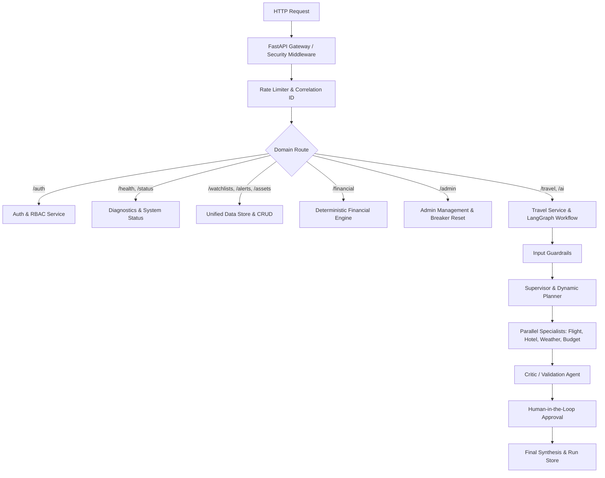

# Multi_AI_Agent — Production-Grade Multi-Agent AI Orchestration Platform

[](https://github.com/backendwithvishal/Multi_AI_Agent)
[](https://python.org)
[](https://fastapi.tiangolo.com)
[](https://langchain-ai.github.io/langgraph/)
[](https://modelcontextprotocol.io/)
[](LICENSE)

An enterprise-grade **Multi-Agent AI Orchestration Platform** built with **LangGraph**, **Model Context Protocol (MCP)**, **FastAPI**, **PostgreSQL**, **Redis**, and **Groq LLM**.

Designed for high-throughput, fault-tolerant execution of multi-agent workflows with dynamic DAG planning, critic-based output validation, deterministic financial calculations, role-based access control, workflow replay, and production cloud deployment on **Render**.

---

## 🌟 10 Backend API Domain Modules

The platform is structured into 10 clean, feature-driven backend API domains:

| # | Domain Module | Route Prefix | Key Capabilities |
|---|---|---|---|
| **1** | **Health** | `/api/v1/health` | Comprehensive telemetry, DB connectivity, memory/Redis cache health, container liveness & readiness probes |
| **2** | **Status** | `/api/v1/status` | Real-time system operational status, agent registry status, circuit breaker states, LLM router tier status |
| **3** | **AI Analysis** | `/api/v1/ai/analysis` | Itinerary feasibility evaluation, budget constraint verification, travel risk assessment via `CriticAgent` & `DynamicPlanner` |
| **4** | **Auth** | `/api/v1/auth` | User registration, login, token generation, user profile, role-based access control (`user` vs `admin`) |
| **5** | **Watchlists** | `/api/v1/watchlists` | Destination & flight/hotel price watchlists, tracking price targets, complete CRUD operations |
| **6** | **Alerts** | `/api/v1/alerts` | Price drop alerts, weather risk alerts, custom notification rules, read state updates |
| **7** | **Assets** | `/api/v1/assets` | Trip assets & documents (e-tickets, booking vouchers, packing checklists, itineraries) |
| **8** | **Financial** | `/api/v1/financial` | Deterministic financial engine: itemized cost calculator, multi-currency conversion, budget variance analysis (NO LLM math) |
| **9** | **Admin** | `/api/v1/admin` | RBAC-protected administrative endpoints: platform metrics, user management, circuit breaker reset, cache purge, execution audit |
| **10** | **AI** | `/api/v1/ai`, `/api/v1/travel` | Task DAG planning (`/ai/plan`), direct specialist agent execution (`/ai/agents/{name}/invoke`), full multi-agent workflow & SSE streaming |

---

## 📐 System Architecture



---

## 📊 Empirical Benchmarks & Test Suite

- **Pytest Test Suite**: `39/39 (100%) passing tests`
- **Guardrail Classification Accuracy**: `100.0%`
- **Agent Routing Match Accuracy**: `100.0%`
- **Parallel Fan-Out Latency Reduction**: `~57.2%`
- **Average Evaluator Latency**: `9.9 ms`

```bash
# Run the complete test suite
pytest -v

# Run the agent evaluation benchmark
python -m evaluation.evaluator

# Run the latency fan-out benchmark
python benchmark.py
```

---

## 🛠️ Quickstart & Local Development

### 1. Clone & Setup Environment
```bash
git clone https://github.com/backendwithvishal/Multi_AI_Agent.git
cd Multi_AI_Agent
cp .env.example .env
```

### 2. Configure Environment Variables
Edit `.env` and set your API keys:
```env
APP_ENV=development
API_KEY=your_platform_api_key
GROQ_API_KEY=your_groq_api_key
OPENROUTER_API_KEY=your_openrouter_api_key
TAVILY_API_KEY=your_tavily_api_key
OPENWEATHER_API_KEY=your_openweather_api_key
AVIATIONSTACK_API_KEY=your_aviationstack_api_key
```

### 3. Run Development Server
```bash
python -m venv venv
source venv/bin/activate  # On Windows: venv\Scripts\activate
pip install -r requirements.txt
python app.py
```
Open interactive docs at [http://localhost:8000/docs](http://localhost:8000/docs).

### 4. Run Docker Container
```bash
docker compose up --build
```

---

## 📜 Project Structure

```text
Multi_AI_Agent/
├── app.py                         # FastAPI Application Entry Point & Route Mounting
├── benchmark.py                   # Empirical Latency Fan-Out Benchmark Script
├── custom_weather_mcp_server.py   # FastMCP OpenWeather Server (stdio)
├── Dockerfile                     # Multi-stage production Dockerfile
├── docker-compose.yml             # Local Docker Compose setup (API + Postgres)
├── mcp_client.py                  # MultiServerMCPClient Connection Manager
├── pytest.ini                     # Pytest discovery configuration
├── render.yaml                    # Render Blueprint IaC Specification
├── requirements.txt               # Dependencies
├── postman/
│   └── Multi_AI_Agent.postman_collection.json # 10 Domain Postman Collection
├── docs/
│   ├── CODEBASE_AUDIT.md          # Comprehensive Codebase Audit
│   └── RENDER_DEPLOYMENT.md       # Render Cloud Deployment Guide
├── evaluation/
│   ├── benchmark_dataset.json     # Test cases for evaluation
│   └── evaluator.py               # Benchmark execution runner
├── tests/                         # Pytest test suite (39 passing tests)
│   ├── test_domain_modules.py     # 10 Domain API module tests
│   ├── test_v1_api.py             # Versioned travel, runs, auth tests
│   └── ...
└── tripmate/
    ├── agents/                    # Dynamic Agent Registry, Planner, Critic, Specialists
    ├── api/                       # Versioned REST & SSE Streaming Routers (10 Domains)
    ├── cache/                     # Hybrid Redis & Bounded Async TTL Cache
    ├── config/                    # Typed Pydantic Settings
    ├── database/                  # Unified Data Store & LangGraph Checkpointer
    ├── graph/                     # LangGraph StateGraph Execution Assembly
    ├── integrations/              # Resilience Circuit Breakers & MCP Wrappers
    ├── middleware/                # Rate Limiter, Correlation ID, Security Headers
    ├── schemas/                   # Pydantic Schemas for all 10 Domains
    └── services/                  # Domain Services (Auth, Watchlist, Alert, Asset, Financial, Admin, Travel)
```

---

## 📄 License

This project is licensed under the MIT License - see the [LICENSE](LICENSE) file for details.
