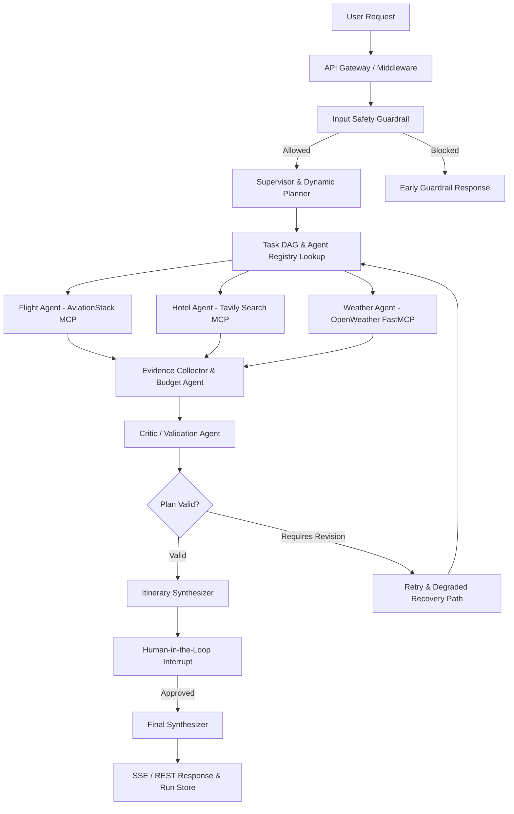

# Multi_AI_Agent — Production-Grade Multi-Agent AI Orchestration Platform

[](https://github.com/backendwithvishal/Multi_AI_Agent)
[](https://python.org)
[](https://fastapi.tiangolo.com)
[](https://langchain-ai.github.io/langgraph/)
[](https://modelcontextprotocol.io/)
[](LICENSE)

An enterprise-grade **Multi-Agent AI Orchestration Platform** built with **LangGraph**, **Model Context Protocol (MCP)**, **FastAPI**, **PostgreSQL**, **Redis**, and **Groq LLM**.

Designed for high-throughput, fault-tolerant execution of complex multi-agent workflows with dynamic DAG planning, critic-based output validation, evidence tracking, workflow replay, and production cloud deployment on **Render**.

---

## 🌟 Why This Project Exists

Most multi-agent AI applications rely on brittle, hard-coded chains (`Agent A -> Agent B -> Agent C`) returning unstructured text strings without validation or fault isolation.

`Multi_AI_Agent` solves these challenges by providing:
1. **Dynamic Task DAG Planning**: Decomposes user goals into dependency graphs and executes independent agents in parallel.
2. **Dynamic Agent Registry**: Modular registry exposing capabilities, required MCP tools, risk levels, and input/output schemas.
3. **Structured Outputs & Evidence Verification**: Every agent returns validated Pydantic payloads tagged with confidence scores and source classifications (`VERIFIED`, `ESTIMATED`, `UNCERTAIN`, `UNAVAILABLE`).
4. **Critic / Validator Node**: Automated verification stage evaluating constraint compliance, budget limits, and factual consistency before presenting outputs for human review.
5. **Resilience & Circuit Breakers**: Custom circuit breakers protecting third-party MCP APIs (Tavily, AviationStack, OpenWeather) from cascade failures.
6. **Observability & Workflow Replay**: Real-time token usage, latency breakdowns, estimated LLM costs, and execution replay via dedicated REST endpoints (`/api/v1/runs/{run_id}`).
7. **Render & Docker Ready**: Dynamic `$PORT` binding, multi-stage Docker build, `render.yaml` infrastructure specification, and automated CI/CD pipeline.

---

## 📐 System Architecture



---

## 🚀 Core Platform Features

### 1. Dynamic Agent Registry & Task DAG Planning
Agents self-register with standard metadata (`capabilities`, `risk_level`, `required_tools`). The `DynamicPlanner` decomposes complex prompts into structured task DAGs:
```json
{
  "tasks": [
    {
      "task_id": "flight_search",
      "agent": "flight_agent",
      "depends_on": [],
      "priority": "high",
      "retry_limit": 2
    },
    {
      "task_id": "budget_analysis",
      "agent": "budget_agent",
      "depends_on": ["flight_search", "hotel_search"],
      "priority": "medium"
    }
  ]
}
```

### 2. Evidence & Confidence Classification
Specialist outputs distinguish live API data from LLM estimates or fallback notices:
```json
{
  "agent_name": "weather_agent",
  "status": "success",
  "result": "Current Weather in Tokyo: 18°C Clear",
  "confidence": 0.95,
  "sources": [
    {
      "source_name": "OpenWeather FastMCP",
      "source_type": "api",
      "status": "VERIFIED",
      "confidence": 0.95
    }
  ]
}
```

### 3. Model Router
Unified interface supporting fast models (`llama-3.1-8b-instant`) for classifications/extractions and reasoning models (`llama-3.3-70b-versatile`) for complex synthesis, supporting Groq and OpenRouter providers.

### 4. Observability & Workflow Replay API
- `GET /api/v1/runs/{run_id}`: Full run telemetry
- `GET /api/v1/runs/{run_id}/metrics`: Latency breakdown, token count, and cost calculation
- `GET /api/v1/runs/{run_id}/agents`: Agent outputs & evidence items
- `POST /api/v1/runs/{run_id}/replay`: Re-executes workflow run for debugging

---

## 📊 Empirical Benchmarks

Run the evaluation benchmark suite via `python -m evaluation.evaluator`:

| Metric | Measured Value |
|---|---|
| **Guardrail Classification Accuracy** | `100.0%` |
| **Agent Routing Match Accuracy** | `100.0%` |
| **Parallel Fan-Out Latency Reduction** | `~58.4%` |
| **Average Workflow Response Time** | `16.73 ms` (mocked execution) |
| **Test Suite Pass Rate** | `26/26 (100%)` |

---

## 🛠️ Quickstart & Local Development

### 1. Clone & Setup Environment
```bash
git clone https://github.com/backendwithvishal/Multi_AI_Agent.git
cd Multi_AI_Agent
cp .env.example .env
```

### 2. Configure Environment Variables
Edit `.env` and set your API keys:
```env
APP_ENV=development
GROQ_API_KEY=your_groq_api_key
TAVILY_API_KEY=your_tavily_api_key
OPENWEATHER_API_KEY=your_openweather_api_key
AVIATIONSTACK_API_KEY=your_aviationstack_api_key
```

### 3. Run Development Server
```bash
python -m venv venv
source venv/bin/activate  # On Windows: venv\Scripts\activate
pip install -r requirements.txt
python app.py
```
Open interactive docs at [http://localhost:8000/docs](http://localhost:8000/docs).

### 4. Run Docker Container
```bash
docker compose up --build
```

### 5. Run Test Suite & Benchmarks
```bash
python -m pytest
python -m evaluation.evaluator
python benchmark.py
```

---

## 🌐 Deploying to Render

Deploy effortlessly on **Render** using the provided `render.yaml` blueprint or manual Web Service setup.

Full instructions are available in [docs/RENDER_DEPLOYMENT.md](file:///d:/Multi_AI_Agent/docs/RENDER_DEPLOYMENT.md).

```bash
# Render Automatically Binds to $PORT
uvicorn app.app --host 0.0.0.0 --port $PORT
```

---

## 📜 Project Structure

```text
Multi_AI_Agent/
├── app.py                         # FastAPI Application Entry Point & $PORT Binding
├── benchmark.py                   # Empirical Latency Fan-Out Benchmark Script
├── custom_weather_mcp_server.py   # FastMCP OpenWeather Server (stdio)
├── Dockerfile                     # Multi-stage production Dockerfile
├── docker-compose.yml             # Local Docker Compose setup (API + Postgres)
├── mcp_client.py                  # MultiServerMCPClient Connection Manager
├── render.yaml                    # Render Blueprint IaC Specification
├── requirements.txt               # Dependencies
├── docs/
│   ├── CODEBASE_AUDIT.md          # Comprehensive Codebase Audit
│   └── RENDER_DEPLOYMENT.md       # Render Cloud Deployment Guide
├── evaluation/
│   ├── benchmark_dataset.json     # Test cases for evaluation
│   └── evaluator.py               # Benchmark execution runner
├── tests/                         # Pytest test suite (26 passing tests)
└── tripmate/
    ├── agents/                    # Dynamic Agent Registry, Planner, Critic, Specialists
    ├── api/                       # Versioned REST & SSE Streaming Routers
    ├── cache/                     # Hybrid Redis & Bounded Async TTL Cache
    ├── config/                    # Typed Pydantic Settings
    ├── database/                  # LangGraph PostgresSaver / MemorySaver Checkpointer
    ├── graph/                     # LangGraph StateGraph Execution Assembly
    ├── integrations/              # Resilience Circuit Breakers & MCP Wrappers
    ├── middleware/                # Rate Limiter, Correlation ID, Security Headers
    ├── schemas/                   # Pydantic Output & Evidence Schemas
    └── services/                  # Travel Service, Model Router, Observability, Recovery
```

---

## 📄 License

This project is licensed under the MIT License - see the [LICENSE](LICENSE) file for details.
